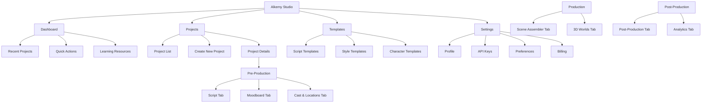
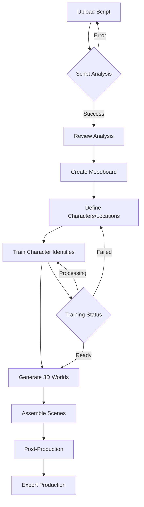
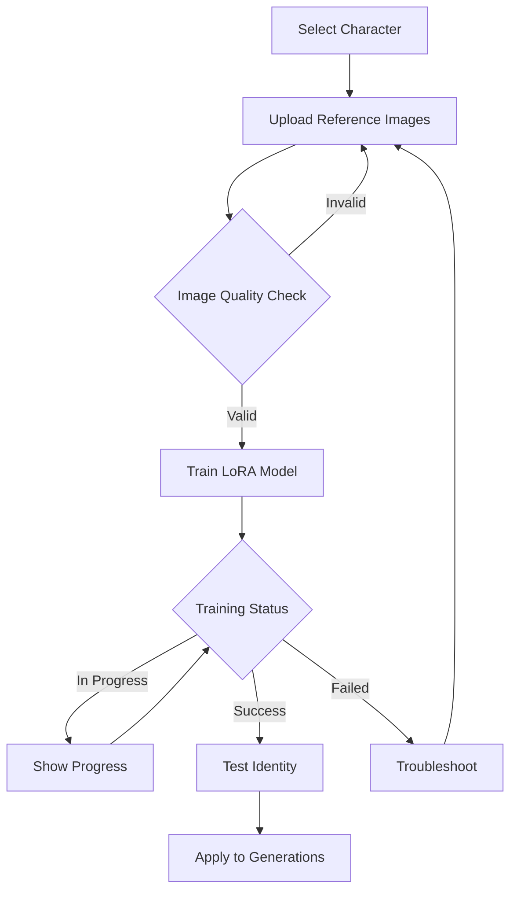

# Alkemy AI Studio V2.0 UI/UX Specification

## Introduction

This document defines the user experience goals, information architecture, user flows, and visual design specifications for Alkemy AI Studio V2.0's user interface. It serves as the foundation for visual design and frontend development, ensuring a cohesive and user-centered experience for this AI-powered film generation platform.

### Overall UX Goals & Principles

#### Target User Personas

- **Filmmaker Creator:** Professional filmmakers and content creators who need comprehensive control over the entire production pipeline. They value advanced features, customization, and professional-quality output.
- **Producer/Coordinator:** Production managers who oversee multiple projects, coordinate teams, and manage deadlines. They need efficient project management, clear progress tracking, and collaboration tools.
- **AI Enthusiast:** Tech-savvy creators excited by AI capabilities. They prioritize cutting-edge features, experimental workflows, and rapid iteration.
- **Beginner Creator:** New users exploring AI-assisted filmmaking. They need guided workflows, clear onboarding, and forgiving interfaces.

#### Usability Goals

- **Ease of learning:** New users can complete their first AI-generated scene within 10 minutes
- **Efficiency of use:** Professional users can complete full script-to-production workflow in under 30 minutes
- **Error prevention:** Clear validation and confirmation for destructive AI operations and expensive API calls
- **Memorability:** Infrequent users can return and understand their project state without relearning
- **Professional output:** Generated content meets industry standards for quality and format

#### Design Principles

1. **Creative confidence** - Every interaction should make users feel powerful and in control of their creative vision
2. **Progressive complexity** - Start simple for beginners, reveal advanced features as expertise grows
3. **Contextual intelligence** - AI should anticipate needs, suggest next steps, and learn from user patterns
4. **Visual storytelling** - The interface itself should communicate narrative flow and production progress
5. **Performance as a feature** - Speed and responsiveness directly impact creative flow and user satisfaction

### Change Log

| Date | Version | Description | Author |
|------|---------|-------------|---------|
| 2025-11-18 | 1.0 | Initial UX specification for Alkemy AI Studio V2.0 | Sally (UX Expert) |

## Information Architecture (IA)

### Site Map / Screen Inventory

### Navigation Structure

**Primary Navigation:** Tab-based workflow navigation (Script → Moodboard → Cast & Locations → Scene Assembler → 3D Worlds → Post-Production → Analytics) with visual progress indicators

**Secondary Navigation:** Sidebar with project management tools, AI model settings, and help resources

**Breadcrumb Strategy:** Tab name + current context (e.g., "Scene Assembler → Scene 3: Opening Shot")

## User Flows

### Core Flow: Script to Complete Production

**User Goal:** Transform a written script into a complete visual production with AI assistance

**Entry Points:** Dashboard "New Project" button, direct script upload, template selection

**Success Criteria:** User generates a complete set of scenes with consistent characters and locations, ready for export

#### Flow Diagram

#### Edge Cases & Error Handling:
- Script analysis failure due to format issues → Provide formatting templates and validation
- Character identity training failures → Offer retry with different reference images
- API rate limiting → Queue operations and provide clear progress indicators
- Insufficient credits → Clear upgrade prompts with usage estimates
- Large file uploads → Progress bars with chunk upload support

**Notes:** This is the primary value proposition flow and should be optimized for smooth progression with minimal friction.

### Secondary Flow: Character Identity Management

**User Goal:** Create consistent character appearances across all generated scenes

**Entry Points:** Cast & Locations tab, Character Identity Modal

**Success Criteria:** Character appears with 90-98% visual consistency across all generations

#### Flow Diagram

#### Edge Cases & Error Handling:
- Insufficient reference images → Guide user to optimal angles and expressions
- Poor image quality → Automatic quality assessment with improvement suggestions
- Training timeout → Provide alternative models or retry options
- Identity test failures → Allow additional training with varied prompts

## Wireframes & Mockups

**Primary Design Files:** [Link to Figma/Miro designs when available]

### Key Screen Layouts

#### Script Tab
**Purpose:** Upload, analyze, and review script content with AI-powered scene extraction

**Key Elements:**
- Drag-and-drop script upload area with format indicators
- Real-time script analysis progress visualization
- Collapsible scene breakdown with character/location extraction
- Interactive script highlighting for scene selection

**Interaction Notes:** Support multiple script formats (PDF, TXT, FDX), show live character frequency analysis, provide inline editing capabilities

**Design File Reference:** [Figma frame link]

#### Scene Assembler Tab
**Purpose:** Shot-by-shot compositing with real-time AI generation

**Key Elements:**
- Timeline view with thumbnail previews of each frame
- Generation panel with AI model selection and parameters
- Canvas area for scene composition and preview
- Character identity injection controls

**Interaction Notes:** Drag-and-drop frame reordering, batch generation options, real-time preview updates, generation progress with estimated times

**Design File Reference:** [Figma frame link]

#### Character Identity Modal
**Purpose:** Train and manage character consistency using LoRA models

**Key Elements:**
- Image upload grid (6-12 images) with quality indicators
- Training progress visualization with status updates
- Visual similarity testing panel with before/after comparisons
- Identity strength controls and character description input

**Interaction Notes:** Auto-crop and optimize uploaded images, show training cost estimates, provide one-click identity testing

**Design File Reference:** [Figma frame link]

## Component Library / Design System

**Design System Approach:** Custom design system built on Radix UI primitives with film production metaphors and AI-native interactions

### Core Components

#### GenerationPanel
**Purpose:** Unified interface for all AI generation operations (images, videos, 3D models)

**Variants:** Compact (sidebar), Expanded (modal), Inline (within workflow)

**States:** Idle, Processing (with progress), Success (with preview), Error (with retry), Queued

**Usage Guidelines:** Always show estimated cost/time, provide cancel capability, display generation history

#### TimelineCanvas
**Purpose:** Visual timeline interface for scene assembly and post-production editing

**Variants:** Single-track (scenes), Multi-track (audio, video, effects), Thumbnail view, List view

**States:** Read-only (viewing), Edit mode (dragging), Playback mode (scrubbing)

**Usage Guidelines:** Maintain sync between visual and timeline representations, support keyboard shortcuts, show snap indicators

#### CharacterCard
**Purpose:** Display character information with identity status and quick actions

**Variants:** Compact (grid), Expanded (details), Edit mode, Generation target

**States:** No identity, Training, Ready, Error, Generating

**Usage Guidelines:** Always show identity status badge, provide quick actions, display recent generations

#### DirectorWidget
**Purpose:** AI assistant for cinematography suggestions and technical guidance

**Variants:** Compact (floating), Expanded (panel), Voice mode, Text mode

**States:** Listening, Processing, Responding, Idle

**Usage Guidelines:** Maintain conversation context, provide voice-to-text toggle, show suggestion confidence

## Branding & Style Guide

### Visual Identity
**Brand Guidelines:** [Link to existing brand guidelines]

### Color Palette

| Color Type | Hex Code | Usage |
|------------|----------|-------|
| Primary | #FFD700 | Main brand yellow for CTAs, highlights, active states |
| Secondary | #2C3E50 | Dark blue-gray for text, borders, professional elements |
| Accent | #E74C3C | Red for errors, warnings, destructive actions |
| Success | #27AE60 | Green for success states, completed generations |
| Warning | #F39C12 | Orange for warnings, processing states |
| Error | #E74C3C | Red for errors, failed operations |
| Neutral | #95A5A6, #BDC3C7, #ECF0F1 | Light grays for backgrounds, dividers, disabled states |

### Typography

#### Font Families
- **Primary:** Inter (modern, highly readable sans-serif)
- **Secondary:** Roboto Mono (for code, technical specifications)
- **Monospace:** SF Mono (for technical details, timestamps)

#### Type Scale

| Element | Size | Weight | Line Height |
|---------|------|--------|-------------|
| H1 | 32px | 700 | 1.2 |
| H2 | 24px | 600 | 1.3 |
| H3 | 20px | 600 | 1.4 |
| Body | 16px | 400 | 1.5 |
| Small | 14px | 400 | 1.4 |

### Iconography
**Icon Library:** Custom icon set based on Lucide React icons with film production theming

**Usage Guidelines:** Use consistent stroke width (2px), maintain yellow brand color for active/primary icons, ensure 24x24px baseline size with 16x16px and 32x32px variants

### Spacing & Layout
**Grid System:** 12-column CSS Grid with 8px base unit, responsive breakpoints at 768px and 1024px

**Spacing Scale:** 4px, 8px, 12px, 16px, 24px, 32px, 48px, 64px (multiples of 4px)

## Accessibility Requirements

### Compliance Target
**Standard:** WCAG 2.1 AA (Level AA compliance)

### Key Requirements

**Visual:**
- Color contrast ratios: 4.5:1 for normal text, 3:1 for large text, 2.5:1 for UI components
- Focus indicators: 2px solid outline with 3px offset in yellow (#FFD700)
- Text sizing: Support 200% zoom without horizontal scrolling

**Interaction:**
- Keyboard navigation: Full keyboard access with Tab/Enter/Space/Arrow keys
- Screen reader support: Semantic HTML, ARIA labels for dynamic content
- Touch targets: Minimum 44x44px for touch interfaces

**Content:**
- Alternative text: Descriptive alt text for all generated images and videos
- Heading structure: Proper h1-h6 hierarchy for screen reader navigation
- Form labels: Explicit labels with aria-describedby for additional context

### Testing Strategy
Automated testing with axe-core, manual keyboard navigation testing, screen reader testing with VoiceOver/NVDA, user testing with assistive technology users

## Responsiveness Strategy

### Breakpoints

| Breakpoint | Min Width | Max Width | Target Devices |
|------------|-----------|-----------|----------------|
| Mobile | 320px | 767px | Phones, small tablets in portrait |
| Tablet | 768px | 1023px | Tablets, small desktop screens |
| Desktop | 1024px | 1439px | Standard desktop monitors |
| Wide | 1440px | - | Large monitors, professional workstations |

### Adaptation Patterns

**Layout Changes:** Mobile uses single-column layout with tab overflow, Tablet uses sidebar collapse, Desktop shows full workspace layout, Wide adds additional panels and tools

**Navigation Changes:** Mobile uses hamburger menu with bottom tab bar, Tablet uses collapsible sidebar, Desktop uses persistent navigation, Wide shows expanded quick actions

**Content Priority:** Mobile shows core generation tools first, Tablet adds timeline controls, Desktop includes full scene assembly, Wide adds analytics and advanced controls

**Interaction Changes:** Mobile optimized for touch with larger targets, Tablet supports touch and mouse, Desktop optimized for keyboard shortcuts and precision control

## Animation & Micro-interactions

### Motion Principles
"Film production narrative" - Every transition should tell part of the production story, with smooth crossfades mimicking film editing techniques and loading animations resembling film reel progress

### Key Animations

- **Scene transitions:** Smooth crossfades (300ms, ease-in-out) between workflow tabs
- **Generation progress:** Staggered film-reel animation with percentage display (Duration: 2s, Easing: ease-out)
- **Character identity reveal:** Sweep animation with character silhouette filling in (Duration: 800ms, Easing: ease-in-out)
- **Timeline scrubbing:** Smooth frame-by-frame preview with hover highlights (Duration: 150ms, Easing: ease-out)
- **Success celebrations:** Brief confetti-like particle effect for completed generations (Duration: 1s, Easing: ease-out)

## Performance Considerations

### Performance Goals
- **Page Load:** Initial dashboard load under 3 seconds on 4G connection
- **Interaction Response:** UI feedback within 100ms for all user interactions
- **Animation FPS:** Smooth 60fps animations and transitions

### Design Strategies
- Lazy loading of media assets with placeholder previews
- Progressive image loading with blur-up effect
- Debounced save operations with optimistic updates
- Efficient state management to prevent unnecessary re-renders
- Optimized bundle splitting for faster initial loads

## Next Steps

### Immediate Actions

1. Review this specification with stakeholders (dev team, product managers, potential users)
2. Create high-fidelity visual designs in Figma based on these guidelines
3. Set up design system component library with Storybook documentation
4. Conduct user testing on key workflows (script upload, character identity, scene assembly)
5. Prepare handoff to Design Architect for frontend architecture specification

### Design Handoff Checklist

- [x] All user flows documented
- [x] Component inventory complete
- [x] Accessibility requirements defined
- [x] Responsive strategy clear
- [x] Brand guidelines incorporated with yellow accent color
- [x] Performance goals established
- [x] Icon library specifications provided
- [ ] Design system components built and tested
- [ ] User testing conducted and findings incorporated
- [ ] Technical feasibility review completed
- [ ] Handoff documentation prepared for development team

## Checklist Results

*UI/UX checklist will be run against this document and results posted here when complete.*